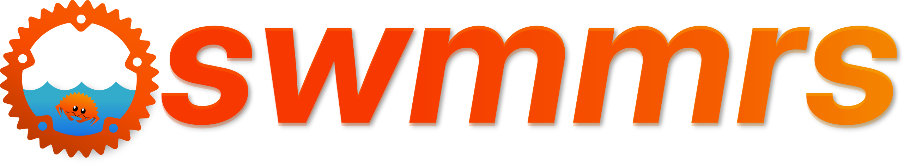

<p align="center">
  
</p>

# swmmrs

Water falls from the sky, encounters a city, and immediately becomes a systems
problem. `swmmrs` is a parity-first Rust port of the EPA Storm Water Management
Model (SWMM), with a command-line runner for anyone who would prefer to model
the flood before reaching for the emergency escape pod.

> [!NOTE]
> **Run SWMM workloads faithfully, faster, and through a modern API.**
>
> `swmmrs` [passes broad regression comparisons against EPA
> SWMM](https://swmm-rs.github.io/swmmrs/regression-validation/). It also offers
> native Python APIs, isolated concurrent simulations, interactive controls,
> checkpoints, typed results, and a command-line runner.
>
> The solver port is complete, but the project remains pre-release. Published
> results are strong parity evidence, not proof for every model or routing
> condition. The Infinite Improbability Drive is not an accepted validation
> method.

## What is this thing?

`swmmrs` is a careful Rust translation of the EPA SWMM solver. It preserves
upstream behavior and structure first. Safety, ownership, testing, and
performance improvements come later, once comparisons show that the water is
still obeying the same laws of physics.

This is not a ground-up hydraulic rewrite, nor a bold attempt to disrupt
gravity. Functions, calculations, comments, and module organization remain
recognizable beside the C source. That makes numerical differences easier to
find, review, and escort off the ship.

The public repository contains:

- `swmmrs`, a Python distribution backed by a package-private native extension.
- `runswmmrs`, a command-line runner distributed as release archives.
- `swmm-output`, a standalone reader for finalized SWMM binary output and
  recoverable complete records.
- public compatibility, packaging, and artifact checks.

Released wheels and CLI archives include the native solver as an implementation
dependency. You do not need to negotiate with a mysterious artifact repository
to run them.

## Why Rust, of all things?

First, this is a personal side project for learning Rust. I could have built the
customary toy application. Instead, I chose to translate a numerical engine
with decades of history and enough domain logic to fill a small moon. SWMM is a
program I already know, use, and care about, so every compiler argument comes
attached to a real engineering problem.

The original EPA SWMM implementation is remarkably well written and
documented. This project depends completely on that work. Its developers made
sensible choices for a performance-critical numerical engine written in C.
Porting it line by line helps me understand both SWMM and Rust. It is not a
claim that the C implementation needs replacing, upgrading, or pointing at a
convenient airlock.

I have spent enough time working in C, and chasing enough segmentation faults,
to know how easily I get pointer-heavy code wrong. SWMM's global mutable state
made my wrapper and interactive-tool experiments hard to isolate. Pointers also
make concurrency and large changes harder for me to reason about. These are
tradeoffs of the language and architecture, not shortcomings of the engineers
who built SWMM. A sonic screwdriver would not help.

Rust's ownership model, compiler checks, and Cargo tooling address exactly the
mistakes I tend to make. The compiler behaves like a suspicious ship's
computer. Before anyone opens the airlock, it wants to know who owns it and how
long they intend to borrow it. Each simulation can own its state instead of
relying on process-wide globals. That makes isolated runs, tests, and extensions
easier to reason about. The main goal remains the same: learn Rust, preserve
upstream behavior, and enjoy working through a difficult codebase I respect.

## Prime directives

1. **Parity before refactoring.** Preserve calculations, evaluation order, edge
   cases, and observable behavior.
2. **Reviewable translation.** Keep C function order, names, comments, and
   module boundaries recognizable. Cleverness has caused enough incidents
   across the galaxy.
3. **Explicit ownership.** Replace process-global solver state with isolated
   `SwmmState` ownership.
4. **Determinism first.** Do not introduce parallel reductions or reordered
   floating-point work without parity evidence.
5. **Tests justify differences.** Any intentional semantic change needs a
   focused test and a documented reason.
6. **Performance after correctness.** Optimize only after the corresponding
   behavior can be compared reliably. Going to plaid is not useful if the
   answer changes.

## Governance, trust, and sentient paperwork

`swmmrs` is an independent, fidelity-first implementation of EPA SWMM. The aim
is to modernize the implementation without quietly redefining the model. EPA
SWMM is the behavioral reference. When results disagree, assume that `swmmrs`
is wrong until a comparison finds an upstream version difference, a documented
EPA issue, or an intentional opt-in departure. The new engine does not get to
declare itself supreme ruler of hydraulics.

`swmmrs` began and remains a personal exercise in learning Rust. I build it for
myself first. That does not imply a promise to publish the solver source. The
source is private so interested developers have a reason to make contact,
exchange ideas, and contribute instead of silently forking the project into a
parallel timeline. People who genuinely intend to contribute can get access.
The point is communication, not exclusivity.

If interest grows enough, the solver source will be released under Apache-2.0.
Solver access requests, GitHub stars, and wider interest will guide that
decision. There is no mysterious counter hidden in a black monolith.

Private source is not evidence of correctness. Neither is an ominously blinking
console. Trust rests on reproducible regression results, published benchmark
methods, documented differences, and clear limits on every claim:
**implementation private; behavior transparent**.
Read the full [project position, governance, and trust
model](https://swmm-rs.github.io/swmmrs/governance/).

## What actually works?

The EPA SWMM solver is fully ported. The Rust implementation stays semantically
close to the C code. Calculations, evaluation order, control flow, function
organization, and domain terminology match upstream wherever Rust's ownership
model permits. This is the part where a starship captain might say the mission
is accomplished. Engineers know better.

The major exception is Dynamic Wave routing, where most of the warning lights
live. Upstream `dynwave` relies on OpenMP and pointer-heavy shared state for
parallel execution. Rust does not provide direct OpenMP support, so this part
of the solver uses Rust's concurrency and ownership model instead. The refactor
keeps `unsafe` code to a minimum while preserving the Dynamic Wave calculations
and deterministic behavior. It is the largest structural departure from the C
implementation, so it remains the highest-priority area for parity testing.

Today, `swmmrs` can:

- open and validate SWMM input files.
- run complete simulations through every solver subsystem.
- write text reports and SWMM binary output files.
- use steady, kinematic, and Dynamic Wave routing.
- calculate rainfall, RDII, runoff, groundwater, snowmelt, infiltration, LID,
  and water quality.
- handle control rules, external forcings, hotstarts, statistics, mass balance,
  and continuity results.
- isolate simulation owners instead of using upstream process-global mutable
  state.
- run independent simulations concurrently with deterministic per-simulation
  state.

`swmmrs` passes an end-to-end regression suite against EPA SWMM. The suite uses
[`swmm-bench`](https://github.com/swmm-rs/swmm-bench) to compare parsed report
tables and binary-output time series across hydrology, hydraulics, controls,
routing, water quality, and interface-file workflows. The [EPA SWMM coverage
report](https://swmm-rs.github.io/swmm-bench/epa-swmm-coverage.html) shows that
the model corpus exercises more than 87% of upstream solver lines and 67% of
branches. The [latest HTML regression
report](https://swmm-rs.github.io/swmmrs/regression-report.html) contains the
current results, for readers who prefer evidence to reassuring noises from the
bridge.

These results support confidence in parity, but no finite suite proves
equivalence for every model. Space may be infinite. A regression corpus is not.

The companion [benchmark
report](https://swmm-rs.github.io/swmmrs/benchmark-report.html) compares
SWMM-compatible engines on large, complex hydraulic models representative of
day-to-day modelling work. It reports simulation duration alongside report and
binary-output similarity. On those workloads, `swmmrs` is faster than EPA SWMM
while maintaining a small result distance from the original engine. The findings apply
to the engines, versions, workloads, and benchmark environment in the report.
They do not confer faster-than-light status on every possible SWMM project or
computer.

Translation is done. Validation is the final frontier: broaden regression
coverage, concentrate comparisons on Dynamic Wave, stabilize the public
interfaces, and expand the binary-output query interface.

## Ship's manifest

| Path | Purpose |
| --- | --- |
| `crates/solver/` | Private native implementation dependency used by authorized builds |
| `crates/run/` | Public `runswmmrs` CLI packaging and smoke-test module |
| `crates/output/` | Public standalone SWMM binary-output reader |
| `python/` | Public `swmmrs` facade and package metadata |
| `js/` | Browser bindings built with wasm-bindgen/wasm-pack and SWMMRS parallel Web Workers |
| `docs/` | User guides, API, and compatibility documentation |
| `scripts/` | Installers, coverage helpers, and mocked artifact tests |

## Install the command-line solver

Choose the console that corresponds to your local planet.

macOS and Linux:

```sh
curl -LsSf https://raw.githubusercontent.com/swmm-rs/swmmrs/main/scripts/install.sh | sh
```

Windows PowerShell: download first, review the script, then run it:

```powershell
Invoke-WebRequest -UseBasicParsing -Uri "https://raw.githubusercontent.com/swmm-rs/swmmrs/main/scripts/install.ps1" -OutFile "$HOME\Downloads\install-swmmrs.ps1"
powershell -NoProfile -File "$HOME\Downloads\install-swmmrs.ps1"
```

See the [command-line installation guide](docs/cli/install.md) for specific
versions, custom install locations, script inspection, supported platforms, and
uninstall instructions.

## Run the command-line solver

```sh
runswmmrs model.inp model.rpt model.out
```

Display command help or the embedded solver version:

```sh
runswmmrs --help
runswmmrs --version
```

## TypeScript and JavaScript bindings

Browsers are small operating systems pretending to be documents, so naturally
`swmmrs` runs there too. The browser package exposes typed object collections,
configuration edits, interactive controls, snapshots, and statistics through a
persistent `Simulation`. Use `runSwmm(input, files, options)` for one-shot runs.

Build and serve the example:

```sh
cargo install wasm-pack --locked
cd js
npm ci
npm run build
npm start
```

Open `http://127.0.0.1:8080/`. The build produces threaded WASM in `dist/` and
serial WASM with unshared memory in `dist/serial/`, using the pinned nightly
toolchain. Deploy the generated `lib/` and all of `dist/`, including
`dist/snippets/` and `dist/serial/`.

Serial execution needs no cross-origin isolation or `SharedArrayBuffer`.
Threaded execution requires both, with COOP and COEP headers as set by
`npm start`. Use `npm start -- --no-isolation` to try the demo without
isolation headers. Even browser workers need the correct docking clearance.

On an isolated page, for a model containing node `J1` and regulator `OR1`:

```js
import { Simulation } from "./index.js";

const simulation = await Simulation.open(input, files, { threads: 2 });
try {
  const basin = simulation.nodes.get("J1");
  const gate = simulation.links.get("OR1");
  for await (const time of simulation.steps({ seconds: 60 })) {
    const { depth } = await basin.results();
    await gate.setTargetSetting(depth > 2 ? 1 : 0.5);
    console.log(time, depth);
  }
  console.log(await simulation.statistics());
  const { report, output } = await simulation.finish();
  // report is text; output is a Uint8Array containing the SWMM binary file.
} finally {
  await simulation.close();
}
```

`input` and each value in `files` accept strings, Blobs, ArrayBuffers, or typed
arrays. External-file keys use slash-separated paths relative to the model.
Use `nodes.snapshot(ids?)` and `links.snapshot(ids?)` for coherent columnar
snapshots rather than one worker message per property. Results use the model's
configured units.
`step()` and `stride(seconds, strict?)` return timezone-free model timestamps,
or `null` at completion. `finish()` can also end a run early.
The returned `report` contains the usual summaries and native runtime footer;
time-series records remain in binary `output`. Repeated `finish()` calls do not
duplicate the footer. Reruns append their report and footer, retaining the
original project-open clock.

Each simulation owns a worker and memory filesystem. Threaded simulations also
own a SWMMRS parallel worker bank. `threads` includes the calling worker and defaults
to browser hardware concurrency on isolated pages, or `1` otherwise.
Explicit `threads: 1` selects the serial build even on isolated pages.
Explicit `threads > 1` on a non-isolated page rejects with an isolation error.
The loader downloads only the selected build. Both builds use the same API and
keep solver work off the UI thread. Separate serial simulations can run in
concurrent workers without shared memory.
The model's `THREADS` setting and existing small-model threshold
select the effective hydraulic count, available through `info()`.
Serial WASM clamps the INP `THREADS` setting to one solver thread. Threaded WASM
rejects INP thread requests above its initialized worker capacity.
Always await `close()` to release workers and files. `readFile(name)` retrieves
additional staged or generated files before close.

See the [TypeScript package guide](js/README.md) for configuration, rain gages,
subcatchments, lifecycle rules, typed errors, frontend asset setup, and the
Python API mapping. Specialized subtype declarations, LIDs, water-quality
controls, checkpoints, hotstarts, and structured output queries are not yet
exposed. Native Rust and Python continue to use the native parallel backend.

Open `/test.html` on the same server to run the browser regression check.
It requires at least two available browser CPU lanes and compares serial and
parallel binary output, reruns, controls, external files, and finalization.

## Open the engine room

> [!NOTE]
> The native solver source is private. Access starts with a conversation about
> contributing; read the [governance and contribution
> model](https://swmm-rs.github.io/swmmrs/governance/).

Rust and native-extension builds require authorized access to the private
solver submodule. After access is granted, initialize all dependencies and run
the complete workspace suite:

```bash
git submodule update --init --recursive
cargo test --workspace --exclude swmmrs-parallel --locked --all-features
```

The root `justfile` provides debug and release builds for each interface:

| Project | Debug | Release |
| --- | --- | --- |
| CLI | `just cli-debug` | `just cli-release` |
| Python wheels | `just python-debug` | `just python-release` |
| JavaScript / TypeScript | `just js-debug` | `just js-release` |

Run `just js-deps` before the first JS build. Python wheels go to
`python/target/wheels/debug/` or `python/target/wheels/release/` without changing
your environment. Use `just --list` for all commands and see the
[contributor guide](docs/contributing/index.md#development-commands) for prerequisites.

The documentation and installer checks do not require solver source, classified
clearance, or a towel. Documentation requires uv and Node.js 22 or newer:

```bash
uv tool install rust-just==1.58.0   # Or install Just through your package manager.
just docs-deps
just docs-check
just docs-serve                   # Watches source comments and previews the site.
./scripts/test-install.sh
```

## Contributing

Public contributions are welcome for documentation, the output reader, Python
API examples, packaging, release checks, validation models, benchmark methods,
and reproducible discrepancy reports. Keep changes compatible with released
artifacts. Include focused validation with each pull request, because "the
computer said it was fine" has ended badly in a surprising number of films.

The private solver repository is shared with people who genuinely intend to
contribute. That can mean code, validation, investigation, review,
documentation, benchmarks, or tooling. See the [governance and contribution
model](https://swmm-rs.github.io/swmmrs/governance/) for details. Do not add
private credentials or solver source to public files.

## Licensing

Original public-repository material, including the Python and CLI interface
source and standalone output reader, is licensed under Apache-2.0. The native
solver source under `crates/solver/` is explicitly excluded and remains private.
Official wheels and command-line archives are freeware under the permissive
[`swmmrs Binary Runtime License`](LICENSES/SWMMRS-BINARY-RUNTIME.txt), which
allows use, modification, and redistribution of compiled artifacts for any
purpose. See [`LICENSE`](LICENSE) for the exact scope and
[`THIRD_PARTY_NOTICES.md`](THIRD_PARTY_NOTICES.md) for upstream licenses and
attribution.

## Acknowledgments

`swmmrs` exists because of the decades of engineering behind [EPA
SWMM](https://www.epa.gov/water-research/storm-water-management-model-swmm) and
the continued stewardship and extensions from the [Open Water
Analytics](https://github.com/OpenWaterAnalytics/Stormwater-Management-Model)
community. No ancient alien technology was recovered during development. This
project builds on human work and treats it with respect. See the [third-party
notices](THIRD_PARTY_NOTICES.md) for the reproduced OWA MIT license, the EPA
public-domain statement, and contributor attribution.
