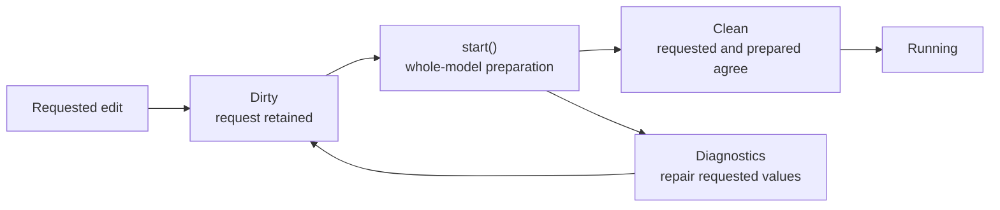

# Declarations and preparation

After opening an input file, `swmmrs` allows selected model inputs to be changed
programmatically. These changes are **declarations**: they state the scenario the
caller wants the next run to use. This is not yet a general-purpose editor for
every SWMM input section. The API reference identifies editable properties;
curves, time series, patterns, land uses, pollutants, controls, and several other
definition families currently remain read-only.

A declaration is not always copied directly into the active solver. Many SWMM
values depend on other objects or require unit conversion, normalization, or
geometry calculations. `swmmrs` therefore separates accepting requested inputs
from preparing one internally consistent solver model.

## Requested and effective values

Consider a requested routing step, thread count, node invert, or conduit
geometry:

1. Your edit records the requested public value.
2. The simulation becomes **dirty** if dependent solver values need rebuilding.
3. `start()` checks the complete requested model and calculates its effective,
   solver-ready values.
4. Only a completely successful preparation replaces the prior prepared model.

A read of a declaration-backed property continues to show what you requested,
even before preparation and after a failed preparation. A specifically named
**effective** or **prepared** property reports what the solver actually selected
or derived. For example, `requested_threads` is an input request, while
`effective_threads` is known after startup.

## Clean and dirty do not mean valid and invalid

| Status | Meaning | What to do |
| --- | --- | --- |
| Clean | The accepted declarations agree with the prepared solver values. | Start or rerun normally. |
| Dirty | At least one accepted declaration requires preparation before routing. | Finish the edits, then call `start()`. |
| Dirty after failed preparation | Requested values conflict at the whole-model level; the previous prepared model was not partially replaced. | Inspect diagnostics, repair declarations, and retry `start()`. |

Dirty is an engineering workflow state, not a quality judgment. It intentionally
allows temporary inconsistencies while a multi-object scenario is assembled.
For example, you can change related elevations in separate calls and resolve the
relationship before starting.

## Two levels of checking

**At assignment time**, `swmmrs` checks facts that can be judged from the value
itself: type, finiteness, representable units, intrinsic range, and applicable
object subtype.

**At start time**, preparation checks relationships that require the prospective
model as a whole: dates and steps, topology, elevations, geometry, selected
patterns, LID relationships, and other cross-object constraints.

A start-time `ConfigurationError` contains ordered diagnostics. It does not
mean that half of the dependent geometry was updated. The requested values stay
available for inspection and repair.

## What atomic means

An operation is **atomic** when it has an all-or-nothing effect.

- A grouped declaration update either accepts the complete candidate or leaves
  the prior declaration unchanged.
- Configuration preparation either installs the complete solver-ready model or
  retains the previous prepared model.
- A rejected candidate does not leave a mixture of old and new fields.

Atomicity is especially important for schedules, options, and object definitions
whose fields are meaningful only together. Prefer grouped `update(...)` methods
when changing related properties.

Atomic does not mean that every logically related object must be edited in one
call. Cross-object edits can be made in stages while dirty; they become one
prepared model only after successful `start()`.

## What idempotent means here

Preparation derives solver values from the authoritative requested declarations,
not by repeatedly modifying the last derived result. Repeating preparation with
the same declarations is intended to produce the same prepared model rather
than compound conversions, offsets, or geometry changes. Empty or unchanged
updates are no-ops where the declaration API supports them.

This matters for parameter sweeps and reruns: a value expressed in project units
should not be converted again merely because a model was prepared more than
once. Idempotence does **not** mean rerunning the hydraulic simulation produces
no work, nor does it make two different floating-point execution paths
identical.

## Not every write is a declaration

Choose the operation by meaning, not only by the object being changed:

| Operation | Example | Effect |
| --- | --- | --- |
| Stable declaration | Pipe geometry, node initial depth, dates, options | May mark configuration dirty; prepared at `start()`. |
| Metadata or reporting edit | Tag or isolated report selection | Usually does not require hydraulic preparation. |
| Persistent forcing | Measured inflow, forecast rain, boundary stage | Kept separately and reapplied according to its lifecycle contract. |
| Runtime control | Gate target during routing | Changes a future routing operation, not stable model geometry. |
| Result read | Current depth or copied statistics | Observes state; does not configure it. |

## After a completed run

A preparation-dependent declaration accepted after `end()` returns the owner to
`OPEN` and resets completed-run clock and report-period bookkeeping for the next
run. Copy required final statistics and write the report before beginning the
next scenario.

For methods and diagnostic examples, see [Configure a model](../guides/configure-model.md).
Continue with [Solver lifecycle](solver-lifecycle.md) to place preparation in the
complete run sequence.
