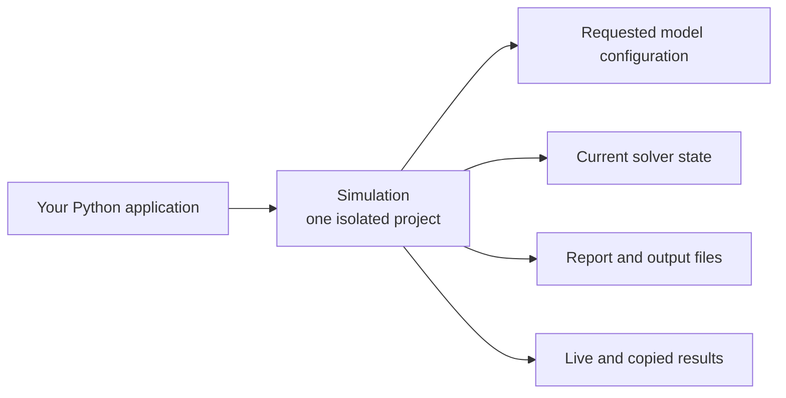

# Programmatic concepts

This section is for water-resources engineers who already understand SWMM and
H&H modeling, but are new to running a solver as a programmable component.
It does not explain runoff or hydraulic theory. It explains how `swmmrs`
organizes a model, when changes take effect, and what different continuation and
result features preserve.

## The central idea

A `Simulation` is a controlled container for one opened SWMM project. It keeps
the project's configuration, changing hydraulic state, files, clocks, controls,
and results together.

This is the practical meaning of **ownership** in these docs: every mutable
piece of a run belongs to a specific `Simulation`. You do not need to manage
Rust memory. You do need to know which simulation a value came from, whether a
requested change has been prepared for the solver, and which phase of the run
allows an operation.

## What is different when SWMM is programmable

| `swmmrs` concept | What it means for a modeller |
| --- | --- |
| Encapsulated state | Two `Simulation` objects are two independent working projects. A change, step, or failure in one does not silently alter the other. |
| Requested declarations | Post-open model edits record the scenario you want. Some dependent solver values are rebuilt only when the run starts. |
| Clean and dirty configuration | Clean means requested inputs and solver-ready derived values agree. Dirty means an accepted change still needs whole-model preparation; it does **not** mean the model is corrupt. |
| Atomic updates | A grouped edit is accepted completely or rejected without a partial change. Start-time preparation also installs all derived changes together or none of them. |
| Explicit lifecycle | Opening, configuring, running, completing, finalizing, and closing are distinct phases. Operations are allowed only where their meaning is unambiguous. |
| Live and owned results | A live object reads the current run. A snapshot or statistics record is a detached copy that remains meaningful after the run advances or closes. |
| Multiple continuation tools | EPA hotstarts, swmmrs checkpoints, in-process forks, and checkpoint State Load preserve different parts of a run. Choose them by modeling purpose, not by convenience alone. |

## Read by question

| Question | Page |
| --- | --- |
| What does it mean for each simulation to have isolated state? | [Isolated simulations and state](simulation-ownership.md) |
| When does a post-open edit take effect, and what do clean, dirty, atomic, and idempotent mean? | [Declarations and preparation](declarations-and-preparation.md) |
| What do `OPEN`, `RUNNING`, `COMPLETE`, `ENDED`, and `FAILED` mean for a workflow? | [Solver lifecycle](solver-lifecycle.md) |
| Should a scenario use a hotstart, checkpoint, fork, or State Load? | [Continuation and branching](continuation-and-branching.md) |

Exact methods and examples live in the [Python user guide](../python/user-guide.md).
