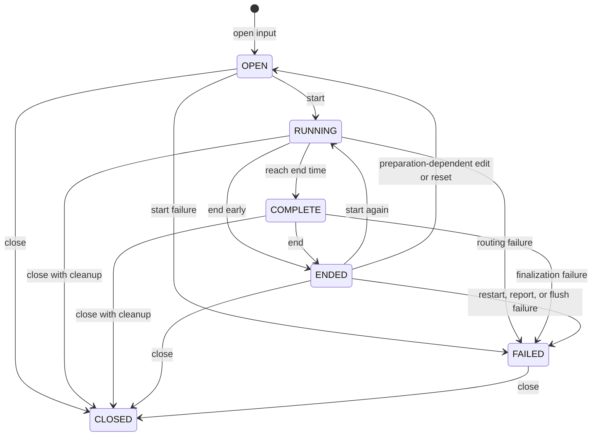

# Solver lifecycle

A programmable solver needs explicit boundaries between editing, calculation,
final accounting, and resource cleanup. `swmmrs` represents those boundaries as
a lifecycle. The lifecycle prevents operations from being applied at a time when
their modeling meaning would be ambiguous.

## The states in modeling terms



| State | Modeling meaning | Typical work |
| --- | --- | --- |
| `OPEN` | The input is parsed and the scenario can be configured, but routing has not started. | Inspect definitions, edit declarations, apply allowed forcing, start, or close. |
| `RUNNING` | Processors are initialized and the model has an active hydraulic timeline. | Advance, observe, apply runtime controls or forcing, save continuation state, or end. |
| `COMPLETE` | Routing reached the configured end time, but finalization has not yet consumed final statistics. | Copy final statistics or snapshots, save a continuation boundary if useful, then end. |
| `ENDED` | The run is finalized, but the parsed project remains available. | Write the report, configure another run, restart, or close. |
| `FAILED` | An operational solver or resource failure made this project generation unsafe to continue. | Preserve the original error and close. |
| `CLOSED` | Native state and files are released. | Open a fresh project generation. |

## Why `COMPLETE` and `ENDED` are separate

Reaching the model end time is not identical to finalizing the run. At
`COMPLETE`, current conditions and final cumulative statistics are still
available for acquisition. `end()` then performs SWMM finalization and moves to
`ENDED`.

The practical rule is: **copy final statistics before calling `end()`**. Write
the detailed report after `end()` when results were saved.

## Choose one advancement owner

A run can be advanced by an iterator or by explicit calls such as `step()` and
`stride()`. Once iteration starts, the iterator owns advancement until it is
exhausted or terminated. Do not mix iterator advancement with manual stepping.

If a loop may stop early, use explicit `step()` or `stride()` calls instead.
Breaking from iteration does not release its advancement ownership; the same
iterator must be advanced until it stops after `terminate()`.

This is not Rust terminology the caller must learn; it is a sequencing rule that
prevents two pieces of application code from moving the same hydraulic clock.
For shared applications, designate one component as responsible for advancing a
simulation and let other components consume copied observations.

## Configuration, forcing, and controls follow different clocks

- Stable model declarations are made while `OPEN` or `ENDED` and are prepared at
  the next `start()`.
- Persistent forcing follows the lifecycle documented for that forcing family
  and can survive native initialization within the same owner.
- Runtime controls are applied while `RUNNING` and influence a later routing
  operation.
- Live results are observed while hydraulic state exists; statistics have a
  narrower acquisition window.

A lifecycle error means the requested operation may be valid in general but not
in the owner's current phase. It is normally a rejected call, not solver damage.

## Completion and cleanup are explicit

A Python context manager guarantees cleanup of the simulation's resources, but
it does not automatically create the detailed report. A common interactive
sequence is:

```text
OPEN -> RUNNING -> COMPLETE -> copy statistics -> ENDED -> report -> CLOSED
```

A one-call batch execution can own this sequence when no intermediate controls
or observations are needed.

`end()` and `close()` are idempotent in the states where repeating them is
allowed: requesting the same completed transition again does not duplicate the
modeling effect. This makes cleanup safer, but it does not permit arbitrary
operations in the wrong state.

## Failure and recovery

Input-value, lifecycle, and configuration-preparation errors usually reject the
operation while leaving the simulation repairable. An operational solver,
finalization, file, or checkpoint failure can establish `FAILED`. Once failed,
do not step or reuse that project generation; preserve the first error and
close it.

See [Run a model](../guides/run-model.md) for workflow examples and [Errors and
recovery](../python/concepts/errors-and-recovery.md) for exception-specific
behavior.
