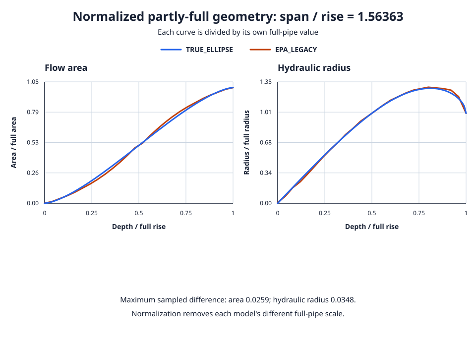
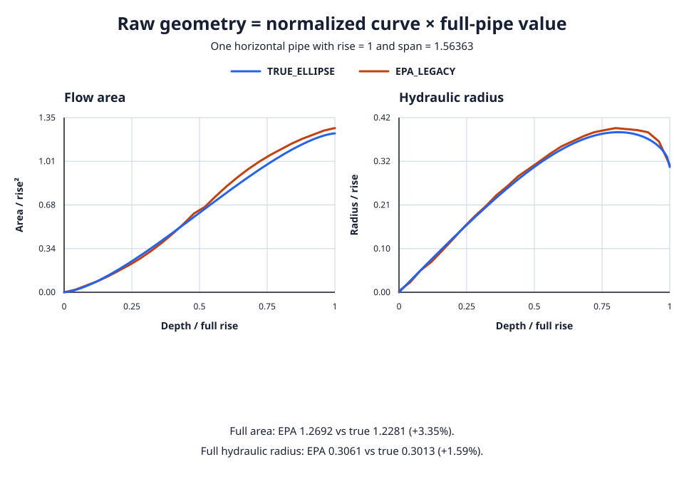
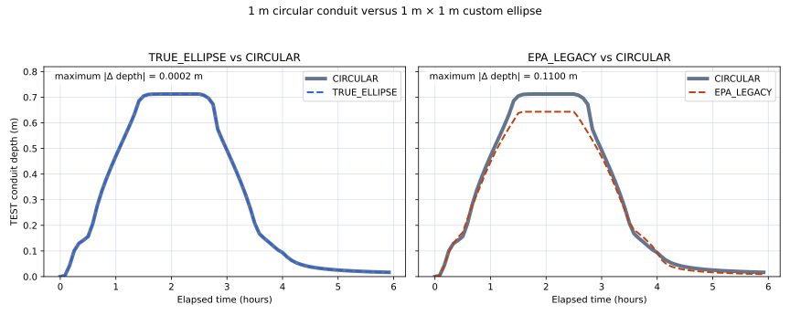

# True-ellipse hydraulics

An ellipse seems an unlikely place for a compatibility dispute. Yet here we
are. `swmmrs` provides two models for custom horizontal and vertical elliptical
conduits:

- `EPA_LEGACY` is the default and preserves released EPA SWMM behavior.
- `TRUE_ELLIPSE` is an explicit opt-in that treats the supplied rise and span
  as the axes of one mathematical ellipse.

The choice applies only to custom ellipses with positive rise and span.
Standard catalog elliptical sections retain their published EPA geometry in
both modes.

The [hydraulic feature index](index.md) gives the short version. Below is the
geometry behind the choice, including why two curves can look reassuringly
similar and still produce different results.

## Motivation

You supply a rise and a span. Released EPA SWMM accepts both, then uses only one
in its full-flow formulas. There is a historical reason for this, though it is
probably not what you expected when you entered the second dimension. For a
horizontal ellipse with rise $R$, the formulas are

$$
A_\mathrm{full}=1.2692R^2
$$

$$
R_{h,\mathrm{full}}=0.3061R.
$$

The vertical form substitutes the span. These equations came from empirical
fits to standard concrete pipes rather than from mathematical ellipse geometry.
They are internally consistent only near the standard-pipe ratio

$$
\frac{\text{span}}{\text{rise}}=1.56363.
$$

EPA issue
[#144](https://github.com/USEPA/Stormwater-Management-Model/issues/144)
first proposed fits using both dimensions:

$$
A_\mathrm{full}=0.8117RS
$$

$$
R_{h,\mathrm{full}}=0.2448\sqrt{RS}.
$$

Using both dimensions looks like the end of the story. The discussion found
one more complication: these are still standard-pipe fits, valid near the
historical ratio. An arbitrary mathematical ellipse has

$$
A_\mathrm{full}=\frac{\pi}{4}RS=0.7854RS.
$$

At the historical ratio, the empirical standard-pipe area is therefore still
3.35% larger than the mathematical ellipse area.

## Evidence from EPA issue #144

The issue discussion is careful about what was measured and what was inferred.
That distinction matters when trying to reconstruct the ancestry of a table:

1. The old `1.2692` and `0.3061` coefficients encode a
   [span/rise ratio of 1.56363](https://github.com/USEPA/Stormwater-Management-Model/issues/144#issuecomment-1890640715).
   Applying them to arbitrary rise and span values ignores part of the user's
   geometry.
2. The proposed `0.8117` and `0.2448` formulas use both dimensions, but remain
   fits to standard pipes clustered around that ratio.
3. Standard-pipe full areas do not quite conform to true ellipses:
   `0.8117 RS` differs from `π RS / 4`.
4. EPA's normalized partly-full width table matches the true-ellipse chord
   equation to its tabulated precision. Rossman inferred that the area and
   hydraulic-radius tables might also represent an ellipse, but
   [clarified that he had verified only width and did not know how the
   hydraulic-radius table was constructed](https://github.com/USEPA/Stormwater-Management-Model/issues/144#issuecomment-1894534620).
   The comparison below measures their differences without establishing their
   provenance.

The issue author consequently recommended using
[true geometry when both dimensions are supplied](https://github.com/USEPA/Stormwater-Management-Model/issues/144#issuecomment-1894011366).
`TRUE_ELLIPSE` implements that recommendation without changing EPA-compatible
defaults or catalog sections.

## Normalized curves versus raw geometry

First, put both models on the same scale. Normalized quantities let us compare
partial-flow shapes independently of their full-pipe values:

$$
f_A(d)=\frac{A(d)}{A_\mathrm{full}},\qquad
f_R(d)=\frac{R_h(d)}{R_{h,\mathrm{full}}},
$$

where $d$ is depth divided by full rise. Each curve is divided by its own
model's full-pipe value. At the historical ratio, the EPA and true-ellipse
normalized curves have similar shapes but measurable differences:



Across the 101 plotted depths, the largest absolute normalized differences are
0.0259 for area and 0.0348 for hydraulic radius. At EPA's 26 table depths, the
Rust checks bound them below 0.026 and 0.034 respectively. EPA's normalized
width values are closer still: below $5\times10^{-5}$ from the ellipse chord
equation at those depths.

At normalized depth 0.32, the EPA horizontal-ellipse area table gives 0.250000,
while the mathematical ellipse gives 0.275868. This difference occurs at a
table entry, so interpolation cannot explain it. Its magnitude also exceeds
the table's rounding precision. Agreement in width does not establish that the
area and hydraulic-radius tables are samples of the same mathematical ellipse.

Now put the dimensions back. Each curve is multiplied by a different full-pipe
value to obtain raw geometry. This is the detail a tidy normalized plot can
persuade you to forget. For a horizontal pipe with rise 1 and span 1.56363:

| Full-pipe quantity | `EPA_LEGACY` | `TRUE_ELLIPSE` | EPA difference |
| --- | ---: | ---: | ---: |
| Area divided by rise² | 1.2692 | 1.2281 | +3.35% |
| Hydraulic radius divided by rise | 0.3061 | 0.3013 | +1.59% |

Thus

$$
A_\mathrm{EPA}(d)=f_{A,\mathrm{EPA}}(d)\times1.2692
$$

while

$$
A_\mathrm{true}(d)=f_{A,\mathrm{true}}(d)\times1.2281.
$$

At half depth both normalized areas are essentially 0.5, yet the raw areas are
0.6346 and 0.6140. The raw curves cannot coincide even where their normalized
shape agrees exactly:



Both plots are produced by a standard-library script kept with the solver
implementation. From the repository root, regenerate them with:

```console
./crates/solver/docs/generate_true_ellipse_plot.py
```

## Implementation

For rise $R$, span $S$, depth $y$, and

$$
a=S/2,\qquad b=R/2,\qquad
d=y/R,\qquad \phi=\cos^{-1}(1-2d),
$$

`TRUE_ELLIPSE` uses one geometry model throughout:

$$
W(y)=2a\sin\phi
$$

$$
A(y)=ab(\phi-\sin\phi\cos\phi)
$$

$$
P(y)=2\int_0^\phi
\sqrt{a^2\cos^2\theta+b^2\sin^2\theta}\,d\theta
$$

$$
R_h(y)=\frac{A(y)}{P(y)}
$$

$$
S_f(y)=A(y)R_h(y)^{2/3}.
$$

Full area, full hydraulic radius, section factor, maximum section factor, and
partly-full values all come from these equations. True full-flow values are
never combined with EPA partly-full tables.

The geometry is prepared once, before routing. There is no need to rediscover
the perimeter of the same ellipse at every routing iteration:

- area and width use shared tables of 51 equally spaced depths;
- hydraulic radius uses one table per exact span/rise ratio;
- wetted perimeter uses deterministic 16-point Gauss–Legendre quadrature over
  four panels;
- routing retains the existing table lookup and inverse-lookup path.

The default EPA path creates no true-ellipse tables. Reports mark true-ellipse
runs as non-EPA, and checkpoints preserve the selection and reject loading into
a simulation configured for the other model.

## Selecting the model

Input files can opt in before the model opens:

```swmm
[OPTIONS]
CUSTOM_ELLIPSE_MODEL TRUE_ELLIPSE
```

This is a `swmmrs` extension and is not accepted by EPA SWMM. Omission means
`EPA_LEGACY`.

Python can select the same model after opening and before starting:

```python
from swmmrs import CustomEllipseModel, Simulation

simulation = Simulation("model.inp", "model.rpt")
simulation.options.custom_ellipse_model = CustomEllipseModel.TRUE_ELLIPSE
simulation.execute()
```

Assignment marks the open configuration dirty. `start()` or `execute()` then
revalidates and atomically rebuilds affected cross sections before routing.

## Implications for modelling results

Similar-looking curves do not let the routing calculations off the hook.
Changes to geometry reach several parts of the result:

- **Area and storage:** for the same depth, the two models can assign different
  wetted area and conduit volume.
- **Velocity:** velocity follows flow divided by area, so a smaller true-ellipse
  area produces a different velocity for the same flow.
- **Conveyance and capacity:** Dynamic Wave routing uses area, hydraulic radius,
  and the section factor $A R_h^{2/3}$. Differences in either full-pipe scale or
  partly-full curve affect capacity and the computed depth-flow relation.
- **Near-full transitions:** small geometry differences can change when a
  conduit reaches the crown or switches flow regimes. An
  [experiment reported in issue #144](https://github.com/USEPA/Stormwater-Management-Model/issues/144#issuecomment-1890625788)
  found larger depth deviations near pipe crowns, in smaller pipes, and for
  vertical ellipses in that test.
- **Nonstandard aspect ratios:** the released empirical formulas ignore one
  supplied dimension, so divergence can be larger away from the historical
  ratio. `TRUE_ELLIPSE` uses both dimensions directly.

Existing models remain reproducible because `EPA_LEGACY` is the default.
Changing to `TRUE_ELLIPSE` is a hydraulic model change and should be reviewed
like any other change to conduit geometry. Standard catalog ellipses are
unaffected.

## Verification

Focused Rust checks cover:

- unchanged EPA defaults and catalog sections;
- circle equivalence, endpoints, monotonic area, and stable area/depth
  inversion;
- flat, circular, and tall ellipses against denser independent geometry;
- interpolation tolerances and the canonical 1.56363 table comparison;
- input selection, reports, checkpoints, resume, fork, and end-to-end routing.

The public
[`python/tests/test_true_ellipse.py`](https://github.com/swmm-rs/swmmrs/blob/main/python/tests/test_true_ellipse.py)
uses a two-barrel Dynamic Wave model. It infers area through public results:

```python
flow_area_per_barrel = link.flow / 1000 / link.velocity / number_of_barrels
```

The partly-full run checks the selected EPA table or mathematical segment-area
equation. The full run checks each model's full area and resulting velocity.

## Worked Python example: a circular ellipse

An ellipse with equal axes is a circle. That gives us a useful test with very
little room for philosophical disagreement. This example changes only the
`TEST` conduit cross section in one six-hour Dynamic Wave model:

- the reference case uses `CIRCULAR` with diameter 1 m;
- the comparison cases use `HORIZ_ELLIPSE` with rise 1 m and span 1 m;
- every case receives the same inflow hydrograph and is sampled every five
  minutes.

A mathematical ellipse with equal rise and span is a circle. The left subplot
therefore compares two equivalent geometries. Their maximum conduit-depth
difference is 0.000227 m; the remaining numerical difference comes from the
separate circular and true-ellipse lookup-table interpolation paths.

The right subplot uses the same 1 m × 1 m custom ellipse with `EPA_LEGACY`.
The legacy horizontal-ellipse formula assigns it a full area of 1.2692 m²,
while the 1 m circle and `TRUE_ELLIPSE` use $\pi/4=0.7854$ m². That 61.6%
full-area difference changes the depth response by as much as 0.109950 m in
this run.



From the repository root, regenerate the plot and printed differences with:

```console
./docs/run_circle_ellipse_comparison.py
```

The command uses the local `python` project and a temporary Matplotlib 3.11.1
installation; it does not add a project dependency. The script also asserts
that the true-ellipse difference stays below 1 mm and the legacy difference
exceeds 5 cm.

### Complete script

```python
--8 < --"docs/run_circle_ellipse_comparison.py"
```
